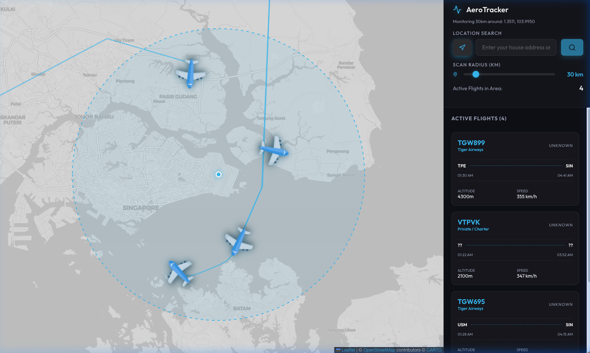

# ✈️ AeroTracker

A real-time flight tracking web application built with React, TypeScript, and Leaflet. Enter any address or use your current location to scan the skies above for active aircraft within a configurable radius.



## Features

- 🗺️ **Interactive Dark Map** — Smooth Leaflet map with CARTO dark tiles
- 📍 **Location Search** — Enter any address or use GPS to set your tracking center
- 🔄 **Real-time Polling** — Flight data refreshes every 15 seconds via adsb.lol API
- ✈️ **Flight Trails** — Historical and live polyline paths for each aircraft
- 🛫 **Route Info** — Origin/destination airports with departure & arrival times
- 🎯 **Bidirectional Selection** — Click a plane on the map or a card in the sidebar to highlight both, pan the map, and scroll the list
- 📡 **Adjustable Radius** — Slide to scan anywhere from 10 km to 250 km

## Tech Stack

- [React](https://react.dev/) + [TypeScript](https://www.typescriptlang.org/)
- [Vite](https://vitejs.dev/) — fast dev server & bundler
- [Leaflet](https://leafletjs.com/) + [react-leaflet](https://react-leaflet.js.org/) — interactive maps
- [Lucide React](https://lucide.dev/) — icons
- [adsb.lol](https://adsb.lol/) — free ADS-B flight data API

## Getting Started

```bash
# Install dependencies
npm install

# Start the development server
npm run dev
```

Then open [http://localhost:5173](http://localhost:5173) in your browser.

## Build for Production

```bash
npm run build
```
